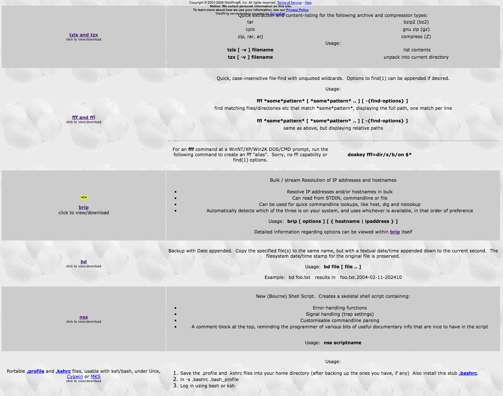

These are some handy UNIX tools that I've been using for years and just
grabbed them from the Wayback machine at
https://web.archive.org/web/20090726060719/http://uk.geocities.com/perdenab/shelltools/index.html

